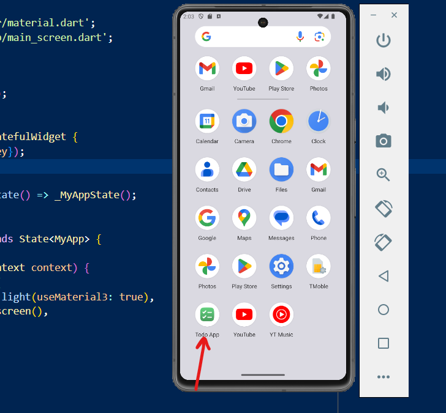
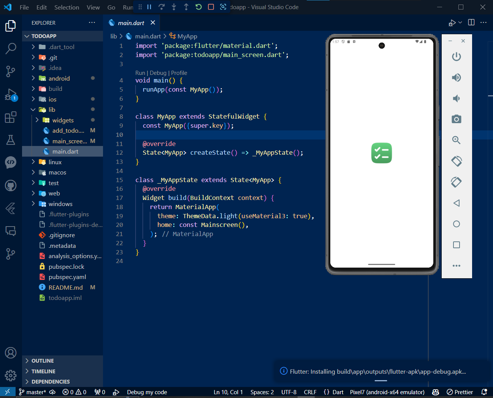
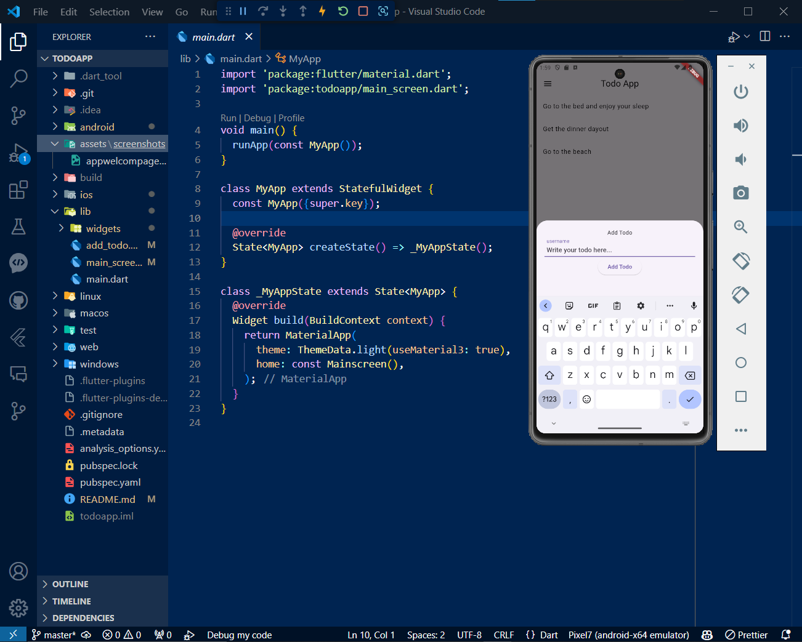
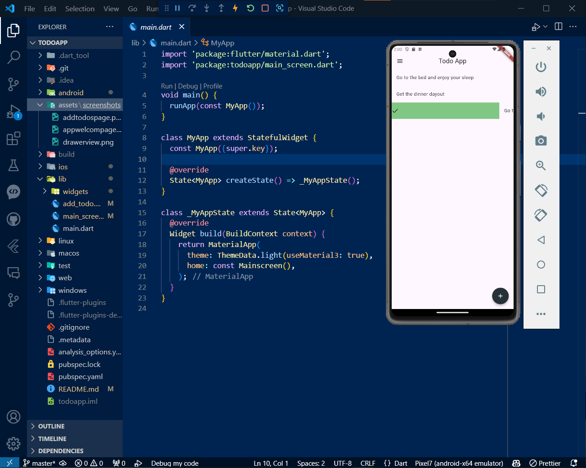
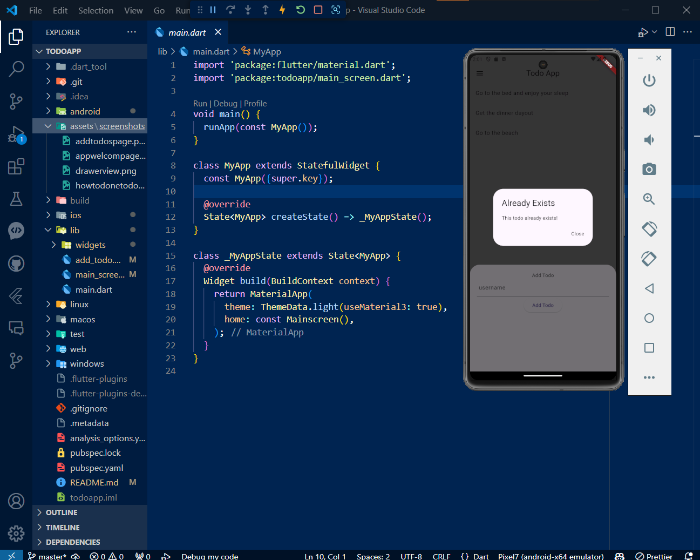
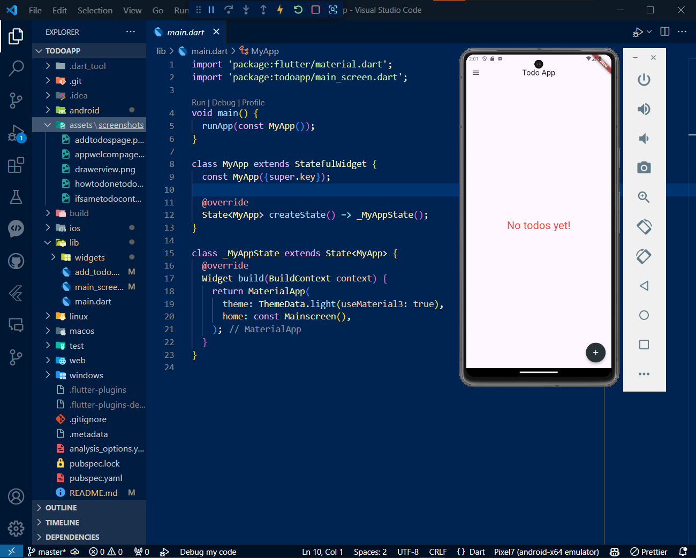

### Todo App
📝 A new Flutter Todo App project.

### 🚀 Getting Started

This project is a starting point for a Flutter application.

A few resources to get you started if this is your first Flutter project:

- [Lab: Write your first Flutter app](https://docs.flutter.dev/get-started/codelab)
- [Cookbook: Useful Flutter samples](https://docs.flutter.dev/cookbook)

For help getting started with Flutter development, view the
[online documentation](https://docs.flutter.dev/), which offers tutorials,
samples, guidance on mobile development, and a full API reference.

### 📚 Project Description

This project is a Flutter application for managing todos. It provides a user-friendly interface to add, remove, and mark todos as done.

### 📦 Packages Used

The following packages were used in this project:

- `url_launcher`: Used to launch web URLs from the app.
- `shared_preferences`: Used for local storage to store todos.
- `flutter_feather_icons`: Used to add a variety of icons to the app.

### 📸 App Snapshots

## App Icon

## App Welcome Screen

## Adding Todos

## Remove Todos

## If Add Same Todos

## If Todos empty 

